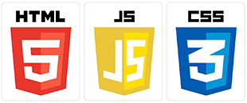

# Web-Marking &nbsp; &nbsp; &nbsp; &nbsp; &nbsp; 

**Project name:** *Mstore*
- - -
## Folders
### <span style="color:green">stuff</span>
Web-Layout view (.psd, .png)
### <span style="color:green">project</span>
It's a project dir.

Do it:
```
npm install
gulp server
```
or just go _**project > public**_ and open file <span style="color:orange">**index.html**</span>
- - -
<span style="color:gray">Mail for communication:</span> <ProUnebit@yandex.ru>
